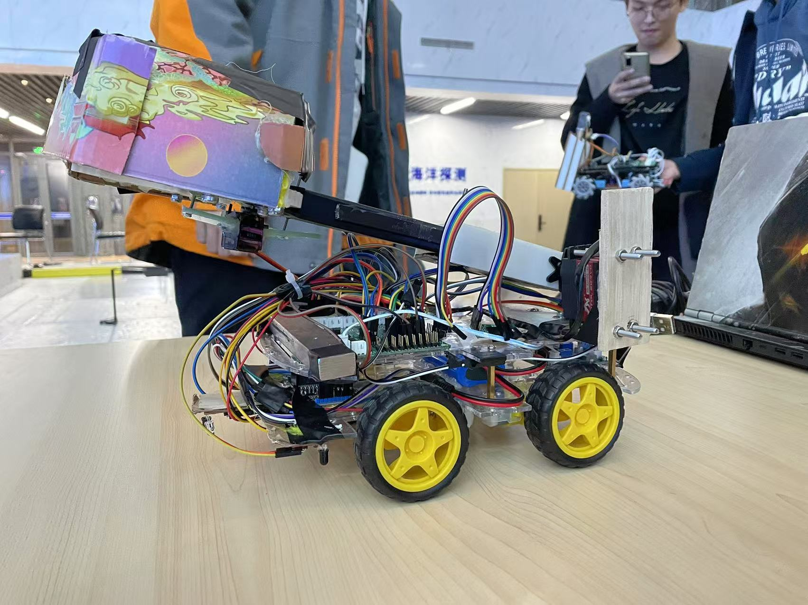
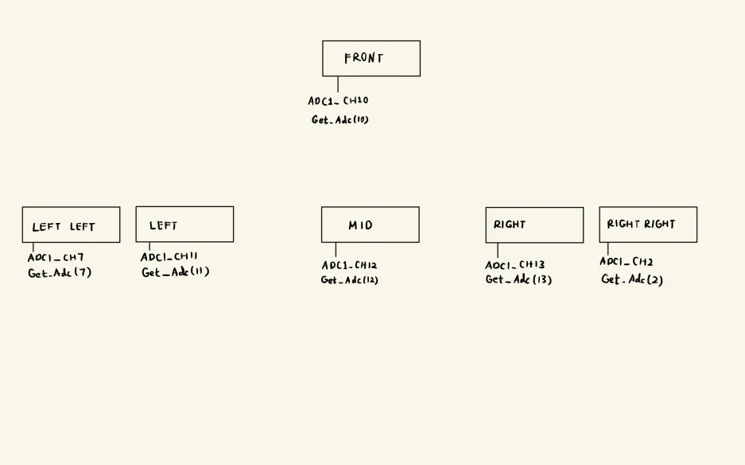
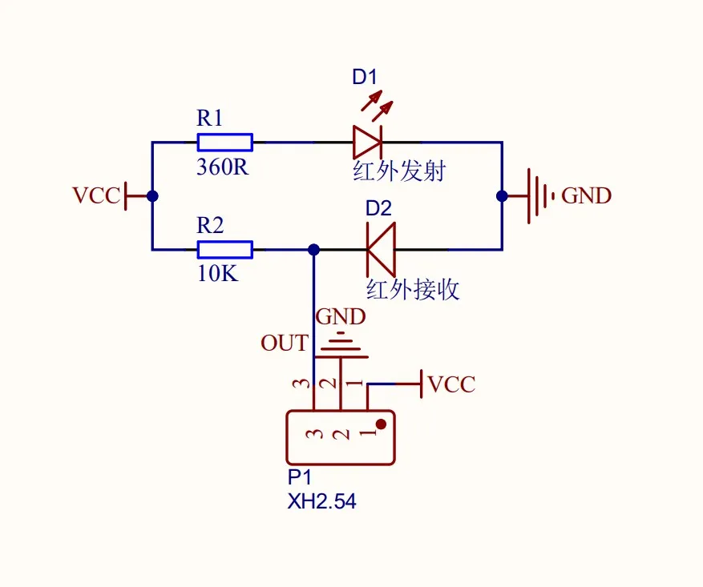
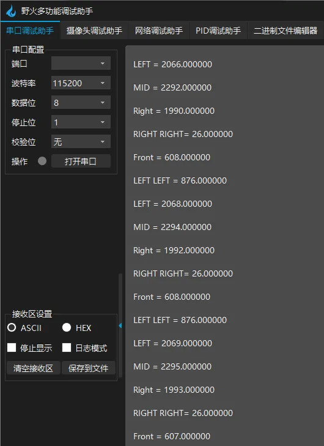

# Project Report
This STM32-based project is under the selection process of 718 laboratory(primary team for robotics team) in Nov. 2021.
- **Developed** a smart car based on the STM32 as the main control board, a power module, and an L298N electric drive module, capable of automatically tracking and remotely retrieving blocks using a robotic arm in specific areas.
- **Utilized** an infrared photocell and ADC to collect voltage signals and used serial port debugging to identify tracks.
- **Developed** a tracking and maze algorithm enabling the car to navigate out of unknown maze environments while tracking.
- **Used** a Bluetooth module with a serial port to achieve remote control of the car and the robotic arm servo.

<div style="text-align: center;">
    
</div>

[Download File](latest.zip)


## (I) Design Concept

### 1. Components and Hardware Configuration
The electrical control system of the line-following vehicle consists of the following modules: 
- **Main Control Board**: A microcontroller minimum system.
- **Photoelectric Sensors**: Infrared photoelectric reflection sensors (referred to as photoelectric pairs) detect black lines by capturing voltage variations.
- **Power Supply Module**: Provides power to the system.
- **HC-05 Bluetooth Module**: Enables wireless control of the vehicle.
- **L298N Motor Driver Module**: Converts PWM signals from the main control board into higher-power electrical signals to drive the motors.

The mechanical drive system includes:
- **Four DC Motors**: The two left motors are connected in parallel to the motor output "B" of the motor driver, while the two right motors are connected to "A". Speeds are controlled via ENA (for the right side) and ENB (for the left side) using PWM signals.
- **Two Servos**: 
  - Servo 1 is connected to `TIM1_CH3` and controls the lifting angle of the robotic arm. A high-torque servo (25 kg) is used due to the arm's weight.
  - Servo 2 is connected to `TIM1_CH4` and controls the gripper mechanism, utilizing an MG90s metal gear digital servo.

### 2. Pin Assignments
- **Motor Control**: 
  - Right motors are connected to output "A" of the motor driver, with speed controlled by ENA (`TIM1_CH1`). Forward/reverse directions are controlled by `PB6` and `PB7`. 
  - Left motors are connected to output "B", with speed controlled by ENB (`TIM1_CH2`). Forward/reverse directions are controlled by `PC6` and `PC7`.

- **Servo Control**: 
  - Servo 1 (`TIM1_CH3`) for robotic arm lifting.
  - Servo 2 (`TIM1_CH4`) for gripper operation.

- **Photoelectric Sensors**: 
  - `LEFTLEFT` to `ADC1_CH7`, `LEFT` to `ADC1_CH11`, `MID` to `ADC1_CH12`, `RIGHT` to `ADC1_CH13`, `RIGHTRIGHT` to `ADC1_CH2`, and `FRONT` to `ADC1_CH0`.

<div style="display: flex; flex-direction: column; align-items: center; margin: 10px;">
    
    <p style="text-align: center;">ADC Photocell Layout - Top View</p>
</div>


- **UART Connections**: 
  - UART5 connects to a USB-to-TTL adapter for debugging and threshold calibration of photoelectric sensors.
  - UART4 connects to the HC-05 Bluetooth module for receiving commands.

### 3. Turning Mechanism
The vehicle uses differential drive for turning, as the two front wheels cannot turn in direction yaw. 
- Left and right motors' directions are controlled by GPIO (`PC6`, `PC7` for left; `PB6`, `PB7` for right).
- Turning angles depend on motor speed and delay durations(30° for tracking in line and 90° for turning). Example functions:

```c
void RightTurn(void) {
    MotorRightLeft_CH1(0);  // Clockwise
    MotorRightLeft_CH2(1);  // Clockwise

    TIM_SetCompare1(TIM1, 10000);
    TIM_SetCompare2(TIM1, 10000);
    delay_nms(570); // Delay for 90° right turn
}

void LeftTurn(void) {
    MotorRightLeft_CH1(1);  // Clockwise
    MotorRightLeft_CH2(0);  // Clockwise

    TIM_SetCompare1(TIM1, 10000);
    TIM_SetCompare2(TIM1, 10000);
    delay_nms(520); // Delay for 90° left turn
}

void RightTurnSlight(void)
{
			MotorRightLeft_CH1(0);	//clockwise
			MotorRightLeft_CH2(1);	//clockwise
			
			TIM_SetCompare1(TIM1,5000);
			TIM_SetCompare2(TIM1,5000);
			delay_nms(190);//向右轻微旋转的时延参数
}

void Converse(void)
{
	MotorRightLeft_CH1(1);	//clockwise
	MotorRightLeft_CH2(0);	//clockwise
			
			TIM_SetCompare1(TIM1,10000);
			TIM_SetCompare2(TIM1,10000);
			delay_nms(1200);//旋转180°的时延参数
			
}
```


### 4. Line Following Mechanism

From the analysis of the photocell sensors in the 718 Laboratory, the following observations are made:

- When the infrared signal emitted by the photocell encounters a **white surface**, the signal is reflected, causing the infrared receiver diode to conduct. Ignoring the forward voltage drop, the `OUT` pin is grounded, and the photocell outputs a **low voltage signal**.
- Conversely, when scanning a **black surface**, the photocell outputs a **high voltage signal**. This characteristic provides the foundation for designing the line-following algorithm.

<div style="display: flex; flex-direction: column; align-items: center; margin: 10px;">
    
    <p style="text-align: center;">Photocell Sensor Working Principle</p>
</div>

---

### Initial Design
Initially, only the `LEFT` and `RIGHT` photocell sensors were used to control both **straight-line tracking** and **right-angle turning at intersections**. The key to achieving this multiplexed functionality was the use of **software filtering**:

1. When the `LEFT` photocell sensor detects the high voltage of a black line, the program waits for **10 milliseconds** and then checks the voltage again.
   - If the voltage is still high, it indicates the car is traveling roughly straight but is slightly deviated to the right.
   - In this case, the `LeftTurnSlight()` function is called to make a **slight left adjustment**, preventing the car from deviating from the straight path.

2. If, after **40 milliseconds** (a parameter determined through tuning), the `LEFT` photocell sensor no longer detects the black line, it indicates that the car has reached a perpendicular black line in the shape of **"┳"** or **"┒"** relative to the forward direction.
   - The program then executes the `LeftTurn()` function to make a **90° left turn**.

3. During parameter tuning, it was observed that the `LeftTurn()` function needed to control the car to turn **slightly more than 90°** for better alignment.

4. The logic for **right turns** is similar and is not repeated here for brevity.

---

### Subsequent Improvements
Later (during an overnight debugging session before the competition), two additional photocell sensors, `LEFTLEFT` and `RIGHTRIGHT`, were added. This modification improved the tracking functionality:

- The `LEFT` and `LEFTLEFT` photocell sensors were assigned specific roles:
  - `LEFT` was responsible for **slight left adjustments** during straight-line tracking.
  - `LEFTLEFT` was responsible for **90° left turns at intersections**.

- Similarly, the `RIGHT` and `RIGHTRIGHT` photocell sensors were configured for slight right adjustments and right turns, respectively.

These enhancements made the tracking function more **stable** and less prone to deviating from the line.

<video width="640" height="360" controls style="display: block; margin: 20px auto;">
  <source src="./maze.mp4" type="video/mp4">
  a simple demo
</video>

---

## (2) Encapsulation of Basic Functions and Achievements

### 1. PWM Output Section

The main control board uses an SN74HC125 chip for voltage following, which isolates the main control board from the PWM signals sent to the electric drive module. To simplify the code, all PWM signals are output through the four channels of `TIM1`. This requires only initializing `TIM1` GPIOs and configuring their modes, which is easier for collaboration.


### 2. ADC Voltage Sampling Section

#### Testing the Photocell Sensor’s Electrical Functionality
1. **Initial Test**:
   - Connect `VCC` and `GND` to a 5V DC power supply.
   - Use an oscilloscope to monitor the signal at the `OUT` pin of the photocell sensor.
   - Test the sensor's output by moving it over **black** and **white** surfaces:
     - The voltage should transition **from high to low** when moving from black to white.
     - If this behavior is observed, the sensor is functioning correctly.

2. **Setup for Debugging**:
   - Mount the photocell sensors on the underside of the tracking car.
   - Prepare a white sheet of paper with black electrical tape to simulate a track.
   - Place the car on the paper and connect the `UART5` serial port to a USB-to-TTL converter for debugging.
   - Write a serial debugging program, upload it to the car, and use a serial assistant tool to observe the voltage changes as the car moves over the black tape.
   - From this observation, determine the **threshold voltage** for the sensor to identify black lines. This threshold may require further tuning after implementing the driving logic.

---

Key Debugging Code in `main.c`:
```c
USART_Config();
Adc_Init();

while(1)
{
    printf("\r\n LEFT LEFT = %f \r\n\r\n LEFT = %f \r\n\r\n MID = %f \r\n\r\n Right = %f \r\n\r\n RIGHT RIGHT= %f \r\n\r\n Front = %f \r\n",
           Get_Adc(7)/1.0, Get_Adc(11)/1.0, Get_Adc(12)/1.0, Get_Adc(13)/1.0, Get_Adc(2)/1.0, Get_Adc(10)/1.0);
    delay_nms(200);
}
```

---

#### Function to Read ADC Values
The function `Get_Adc(u8 ch)` reads voltage values from multiple ADC channels on `ADC1`:

```c
u16 Get_Adc(u8 ch)
{
    ADC_RegularChannelConfig(ADC1, ch, 1, ADC_SampleTime_239Cycles5);
    ADC_SoftwareStartConvCmd(ADC1, ENABLE);

    while(!ADC_GetFlagStatus(ADC1, ADC_FLAG_EOC));

    return ADC_GetConversionValue(ADC1);
}
```

#### Function to Calculate Average ADC Value
The `Get_Adc_Average(u8 ch, u8 times)` function computes the average ADC value over a specified number of samples:

```c
u16 Get_Adc_Average(u8 ch, u8 times)
{
    u32 temp_val = 0;
    u8 t;

    for(t = 0; t < times; t++)
    {
        temp_val += Get_Adc(ch);
        delay_nms(5);
    }
    return temp_val / times;
}
```

---

#### Debugging Results
After implementing the above setup, the ADC values observed at various photocell sensors (`LEFTLEFT`, `LEFT`, `MID`, `RIGHT`, `RIGHTRIGHT`, and `FRONT`) can be used to fine-tune the thresholds for black line detection.

<div style="display: flex; flex-direction: column; align-items: center; margin: 10px;">
    
    <p style="text-align: center;">Excerpt of Serial Debugging Results</p>
</div>


### 3. Serial Communication and Bluetooth Module

#### 3.1 Bluetooth Communication
To match the button functions in the debugging assistant, Bluetooth was used to record commands sent via buttons. Each button corresponds to specific strings (e.g., `B1` to `B6`). The commands are processed in pairs of characters, with the second character determining the action.

#### 3.2 Turning Control
The implementation of left and right turns mirrors the logic in the `bsp_control.c` functions.

#### 3.3 Servo Control (Robotic Arm)
A variable `cnt` is used to adjust the PWM duty cycle for controlling the robotic arm.

#### 3.4 Car Stop Implementation
Initially, GPIO commands were planned to stop the car. However, it was discovered that the state of the PWM-controlled pins is not influenced by GPIO settings in PWM mode. The final implementation stops the car by setting the PWM duty cycle to 0:

```c
TIM_SetCompare1(TIM1, 0);
TIM_SetCompare2(TIM1, 0);
```

#### Key UART Functions
The UART5 port connects to a USB-to-TTL converter to retrieve sensor values, while UART4 connects to the HC-05 Bluetooth module. Bluetooth commands control car movement, stops, and robotic arm operations.

<details>
<summary><b>Click to expand the code for USART Bluetooth Control</b></summary>

```c
// bsp_usart_blt.c

#include "bsp_usart_blt.h"
#include "bsp_servo.h"
#include "bsp_control.h"
#include "bsp_pwm.h"
#include "bsp_delay.h"

extern vu16 cnt;
extern vu16 status;

vu16 cnt2 = 0;

void DEBUG_USART_IRQHandler(void)
{
    uint8_t ucTemp;
    uint8_t ucTemp1;
    if (USART_GetITStatus(DEBUG_USARTx, USART_IT_RXNE) != RESET)
    {
        ucTemp1 = USART_ReceiveData(DEBUG_USARTx);
        ucTemp = USART_ReceiveData(DEBUG_USARTx);
        int i;
        // USART_SendData(DEBUG_USARTx, ucTemp);
        if (ucTemp == '5')
        {
            cnt += 100;
            SetSteerAngle3(cnt);
        }
        if (ucTemp == '6')
        {
            cnt -= 100;
            SetSteerAngle3(cnt);
        }
        if (ucTemp == '1')
        {
            // TIM_OC1PreloadConfig(TIM1, TIM_OCPreload_Enable);
        }
        if (ucTemp == '3')
        {
            MotorRightLeft_CH1(0); // clockwise
            MotorRightLeft_CH2(1); // clockwise

            TIM_SetCompare1(TIM1, 3000);
            TIM_SetCompare2(TIM1, 3000);
            delay_nms(400);
        }
        if (ucTemp == '4')
        {
            MotorRightLeft_CH1(1); // clockwise
            MotorRightLeft_CH2(0); // clockwise

            TIM_SetCompare1(TIM1, 3000);
            TIM_SetCompare2(TIM1, 3000);
            delay_nms(400);
            // USART_SendData(DEBUG_USARTx, ucTemp);
        }
        if (ucTemp == 'U')
        {
        }
        if (ucTemp == '2')
        {
            status++; // Exit the Forward() loop
            // delay_nms(10000);
            // TIM_OC1PreloadConfig(TIM1, TIM_OCPreload_Disable);
        }
        if (ucTemp == '7')
        {
            cnt2 += 100;
            SetSteerAngle4(cnt2);
        }
        if (ucTemp == '8')
        {
            cnt2 -= 100;
            SetSteerAngle4(cnt2);
        }
    }
}

void DEBUG_UART_Config(void)
{
    GPIO_InitTypeDef GPIO_InitStructure;
    USART_InitTypeDef USART_InitStructure;

    DEBUG_USART_GPIO_APBxClkCmd(DEBUG_USART_GPIO_CLK, ENABLE);
    DEBUG_USART_GPIO_APBxClkCmd(DEBUG_USART_GPIO_CLK2, ENABLE);

    GPIO_InitStructure.GPIO_Pin = DEBUG_USART_TX_GPIO_PIN;
    GPIO_InitStructure.GPIO_Mode = GPIO_Mode_AF_PP;
    GPIO_InitStructure.GPIO_Speed = GPIO_Speed_50MHz;
    GPIO_Init(DEBUG_USART_TX_GPIO_PORT, &GPIO_InitStructure);

    GPIO_InitStructure.GPIO_Pin = DEBUG_USART_RX_GPIO_PIN;
    GPIO_InitStructure.GPIO_Mode = GPIO_Mode_IN_FLOATING;
    GPIO_Init(DEBUG_USART_RX_GPIO_PORT, &GPIO_InitStructure);

    DEBUG_USART_APBxClkCmd(DEBUG_USART_CLK, ENABLE);

    USART_InitStructure.USART_BaudRate = DEBUG_USART_BAUDRATE;

    USART_InitStructure.USART_WordLength = USART_WordLength_8b;

    USART_InitStructure.USART_StopBits = USART_StopBits_1;

    USART_InitStructure.USART_Parity = USART_Parity_No; // No parity

    USART_InitStructure.USART_HardwareFlowControl = USART_HardwareFlowControl_None;

    USART_InitStructure.USART_Mode = USART_Mode_Rx | USART_Mode_Tx;

    USART_Init(DEBUG_USARTx, &USART_InitStructure);

    USART_Cmd(DEBUG_USARTx, ENABLE);

    NVIC_Configuration();

    USART_ITConfig(DEBUG_USARTx, USART_IT_RXNE, ENABLE);
}

static void NVIC_Configuration(void)
{
    NVIC_InitTypeDef NVIC_InitStructure;

    NVIC_PriorityGroupConfig(NVIC_PriorityGroup_2);

    NVIC_InitStructure.NVIC_IRQChannel = DEBUG_USART_IRQ;

    NVIC_InitStructure.NVIC_IRQChannelPreemptionPriority = 0;

    NVIC_InitStructure.NVIC_IRQChannelSubPriority = 1;

    NVIC_InitStructure.NVIC_IRQChannelCmd = ENABLE;

    NVIC_Init(&NVIC_InitStructure);
}
```

</details>


### 4. Automatic Control System (4+2 Mode Example)

The automatic control mode has several configurations:
- **(4+2) Mode**: Four sensors on the sides and two in the middle/front.
- **(2+1) Mode**: Two side sensors and one middle sensor.
- **PI Mode**: A positional PI feedback system minimizes oscillation during tracking.
- **Feedback Mode**: Adjusts turning angle delays dynamically based on positional error.

#### Example Code for 4+2 Mode

The car moves forward at a base speed of approximately `TIM_SetCompare1(TIM1, 10000)` while using a position-based PI negative feedback mechanism to maintain stability before invoking the slight left turn and slight right turn functions. Adjustments to this base speed are only made when the photocell sensors detect specific conditions, such as a black line.

- When the **RIGHT** photocell sensor detects a black line, the car performs a **slight right turn**.
- The car executes a **full right turn** only when the **RIGHTRIGHT** photocell sensor detects the black line.

Similarly:
- On the left side, a **slight left turn** is performed when the **LEFT** photocell sensor detects the black line.
- A **full left turn** is executed only when the **LEFTLEFT** photocell sensor detects the black line.

This ensures that the black line is always positioned between the **RIGHT** and **LEFT** photocell sensors, while the **RIGHTRIGHT** and **LEFTLEFT** sensors are designated for executing right-angle turns of 90°. This approach significantly reduces the likelihood of misidentification compared to previous implementations.

Automatic Control Code Example:

```c
void Forward(void)
{
    int Err = 0;
    int error = 0;

    while (status % 2 == 0)  // Automatic control loop
    {
        Err = Err + (Get_Adc(11) - Get_Adc(13));  // Integral component
        error = Get_Adc(11) - Get_Adc(13);       // Proportional component

        if (Get_Adc(13) > 3700 && Get_Adc(2) < 200)  // RIGHT detects black line
        {
            delay_nms(10);
            if (Get_Adc(2) > 200)
                RightTurn();  // Full right turn
            else
                RightTurnSlight();  // Slight right adjustment
        }

        if (Get_Adc(11) > 3900 && Get_Adc(7) < 1500)  // LEFT detects black line
        {
            delay_nms(10);
            if (Get_Adc(7) > 1500)
                LeftTurn();  // Full left turn
            else
                LeftTurnSlight();  // Slight left adjustment
        }

        MotorRightLeft_CH1(1);  // Enable motor movement
        MotorRightLeft_CH2(1);

        // Adjust speed with PI feedback
        TIM_SetCompare1(TIM1, 10000 - Get_Adc(13) * 2.5 + Err * 0.25);
        TIM_SetCompare2(TIM1, 10000 - Get_Adc(11) * 2.5 - Err * 0.25);

        delay_nms(15);
    }
}
```


---

## (3) Issues Encountered and Solutions

### 1. Difficulty in Turning at Intersections
With only two sensors (`LEFT`, `RIGHT`), the car struggled to execute turns at intersections while tracking. The solution involved delaying and filtering sensor readings to differentiate between straight-line deviations and intersections.

### 2. Missed Right-Angle Turns with Four Sensors
When adjusting direction, the car occasionally failed to recognize intersections. The solution involved prioritizing outer sensor readings (`LEFTLEFT`, `RIGHTRIGHT`) for sharp turns.

### 3. Difficulty Detecting Dead Ends
Using filtering alone failed to reliably detect dead ends. A new approach considered both `FRONT` and `MID` sensor readings simultaneously. If both sensors lose the line, the car executes a U-turn.

#### Improved U-Turn Code:
```c
if (Get_Adc(13) < 3700 && Get_Adc(11) < 3900 && Get_Adc(10) > 700)
{
    delay_nms(35);
    if (Get_Adc(13) < 3700 && Get_Adc(11) < 3900)
        Converse();  // Execute U-turn
}
```

---

### 4. Hardware Limitations
- **Pin Shortage**: Lacking enough 3-pin connectors, wires were soldered directly. However, unstable connections led to failures during the competition.
- **PWM Command Issues**: Software delays and GPIO resets failed to reliably stop the car. Introducing an external variable (`status`) allowed better control.

### 5. Improvements to Navigation and Algorithms

#### 1. Enhancing U-Turn Logic
The existing logic for detecting dead ends relied on filtering, which was insufficient. To address this, a `while` loop or additional sensor checks can improve reliability.

##### Improvement Example:
```c
while (Get_Adc(13) < 3700 && Get_Adc(11) < 3900 &&
       Get_Adc(10) < 700 && Get_Adc(7) < 1500 &&
       Get_Adc(2) < 200 && Get_Adc(12) < 3800)
{
    RightTurnSlight();  // Gradually turn until the car finds the track again
}
```

#### 2. Reducing Sensor Spacing
By reducing the distance between the `LEFT` and `RIGHT` sensors:
- **Benefits**:
  - Smaller adjustments for straight-line tracking.
  - Reduced chance of false U-turn detection.

#### 3. Noise Filtering
Implementing an averaging filter on sensor voltage readings can reduce noise and improve stability.

#### 4. PID Optimization
Fine-tuning PID parameters (P, I, D gains) and increasing the algorithm’s complexity can:
- Minimize oscillations during tracking.
- Reduce reliance on manual left and right micro-adjustments.

---

### 6. Bluetooth Control Enhancements

#### Pause/Resume Function
The following function allows the car to pause or resume its operation. It is triggered by Bluetooth commands.

##### Code Example:
```c
extern vu16 status;

void PauseResume(void)
{
    status++;  // Toggle between pause and resume states
}
```

#### Stop at Finish Line
To stop the car upon reaching the finish line, implement a sensor-based check:

```c
if (Get_Adc(13) > 3700 && Get_Adc(11) > 3900 &&
    Get_Adc(10) < 700 && Get_Adc(7) < 1500 &&
    Get_Adc(2) < 200 && Get_Adc(12) > 3800)
{
    PauseResume();  // Trigger the stop function
}
```

#### Adding Reverse Functionality
1. Declare an external variable:
   ```c
   extern vu16 status_reverse;
   ```
2. Update the interrupt handler:
   ```c
   if (ucTemp == '1') {
       status_reverse++;
   }
   ```
3. Adjust motor control logic:
   ```c
   if (status_reverse % 2 == 0)  // Forward mode
   {
       MotorRightLeft_CH1(1);
       MotorRightLeft_CH2(1);
   }
   else  // Reverse mode
   {
       MotorRightLeft_CH1(0);
       MotorRightLeft_CH2(0);
   }
   ```

---

## (4) Maze Solving Using Right-Hand Rule

The right-hand rule prioritizes turning right, followed by straight, then left. For example:
- Right Turn > Straight > Left Turn

---

## (5) Reflection and Future Improvements

### 1. Lessons from the Competition
- **Preparation**: Critical to assemble materials (e.g., connectors) in advance. Late-stage soldering led to reliability issues.
- **On-Site Testing**: Insufficient pre-competition testing caused parameter mismatches with the actual environment.
- **Hardware Stability**: Weak connections (e.g., jumper wires) disrupted performance.

### 2. Algorithmic Enhancements
#### Improving Dead-End Detection
Use a combination of additional sensor checks and dynamic adjustments:
- **Dynamic Angle Adjustment**:
   ```c
   if (Get_Adc(13) < 3700 && Get_Adc(11) < 3900)
       RightTurnSlight();
   ```

#### Path Memory and Learning
To find the shortest path, implement memory-based navigation:
1. At intersections, log actions (`R`, `L`, `S`, `U`) in an array `a[]`.
2. Simplify the path using rules like:
   ```text
   RUR = S; SUR = L; RUS = L; SUS = U; LUR = U
   ```
3. Store the optimized path in array `b[]`.

---

### 3. Reflections
Despite technical setbacks during the competition, we gained valuable experience. Each failure became an opportunity to improve skills in hardware and software design. Notably, we progressed from building a simple car to solving complex maze challenges within three months.

The journey emphasized:
- **Teamwork**: Every member's effort contributed to the car’s functionality.
- **Resilience**: Tackling unexpected problems under time constraints highlighted we's determination.


