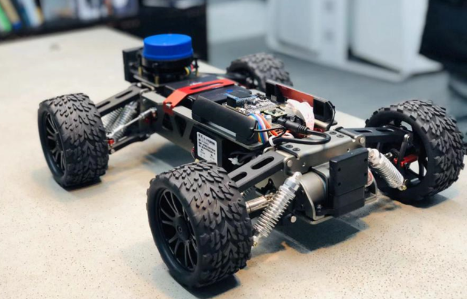
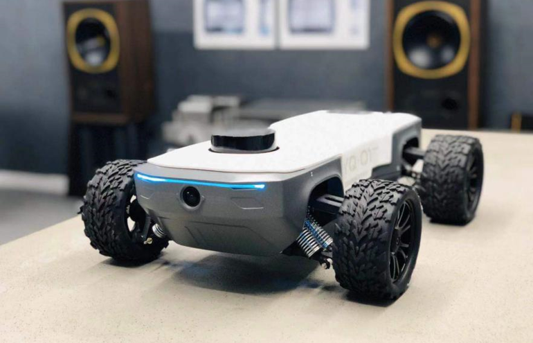
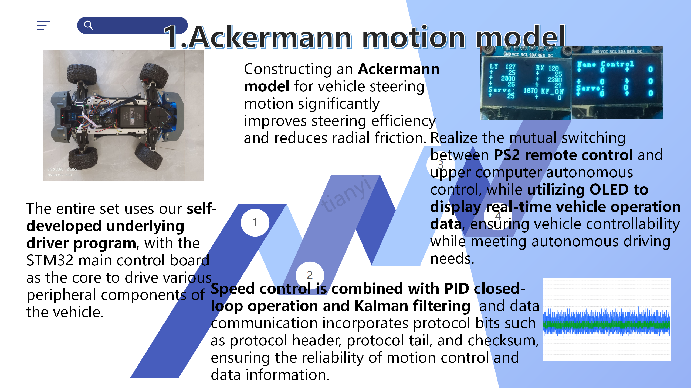
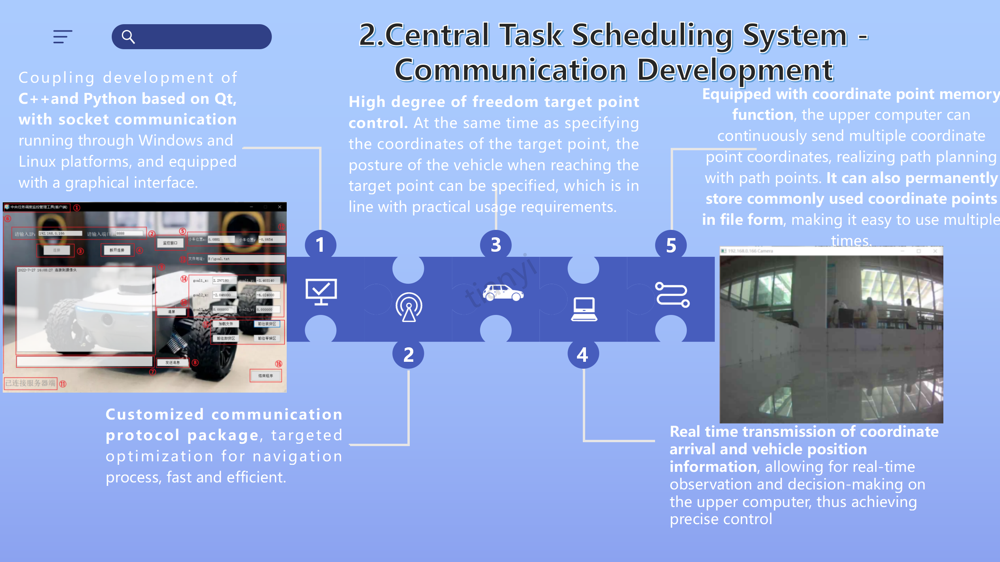
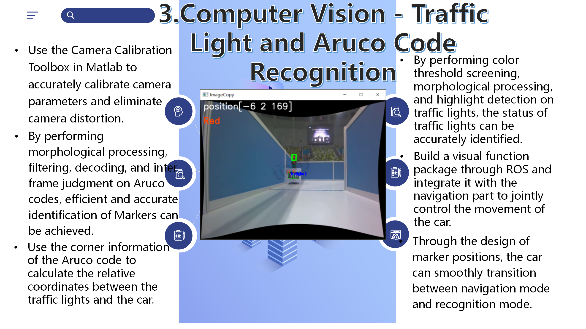
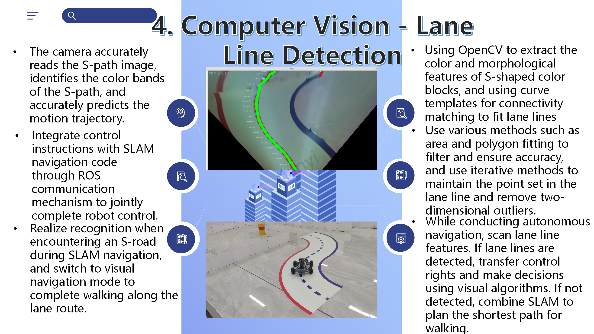
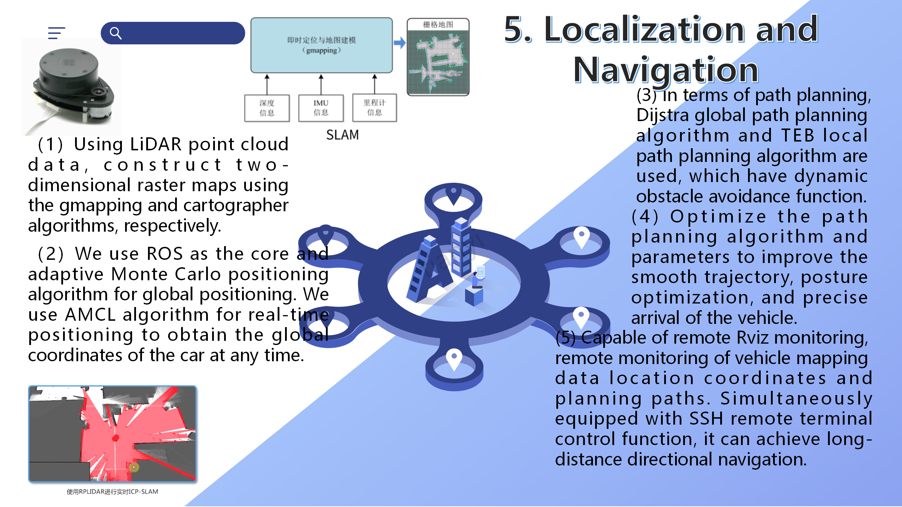
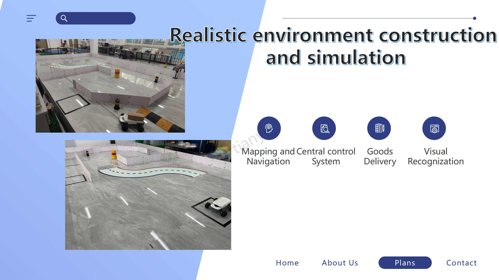
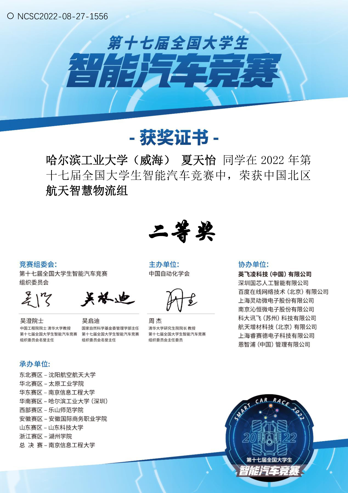
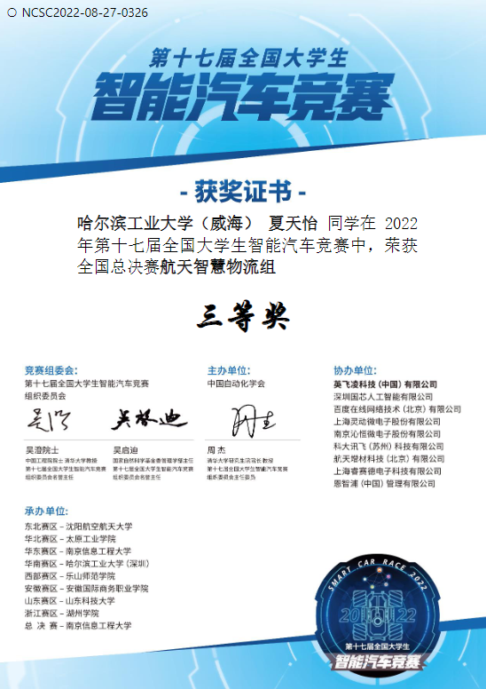

# Introduction
We complemented the algorithms for AGV in real scenarios, and achieved great performance from reginal competiton to national competition. This project was also shown as an excellent work in university innovation competitions.

Due to privacy reasons, the final reports(seven documents) will not be shown here. If you are interested in it, you could contact me for more information.

- **Developed and implemented** an automated guided vehicle with the functions of SLAM, navigation, traffic light recognition, lane detection, and tracking using OpenCV and other technologies on STM32 and Jetson Nano.
- **Applied** lidar and camera as sensors with AMCL and path planning algorithms such as A*, Dijkstra, and genetic algorithms to perceive the surroundings, avoid static and dynamic obstacles, and automatically move to the target point. Tested ORB-SLAM series algorithms.
- **Developed** a Navigation Visualization Interface based on ROS and Qt, including functions such as target sending, terminal input, and map and trajectory visualization.

<!--  -->

    

        
        <!-- 
Image 1 Caption
 -->
    

    

        
        <!-- 
Image 2 Caption
 -->
    

## Key Technology Implementation
There are five parts of key technology.
### Ackermann motion model

### Central Task Scheduling System - Communication Development

### Computer Vision - Traffic Light and Aruco Code Recognition

<video width="640" height="360" controls style="display: block; margin: 20px auto;">
  <source src="./redgreen.mp4" type="video/mp4">
</video>

### Computer Vision - Lane Line Detection

<video width="640" height="360" controls style="display: block; margin: 20px auto;">
  <source src="./s.mp4" type="video/mp4">
</video>

### Path planning and Navigation

### Demonstration in Real Scenario

<video width="640" height="360" controls style="display: block; margin: 20px auto;">
  <source src="./final.MP4" type="video/mp4">
</video>

## Awards

    

        
        
certificate_of_merit-regional

    

    

        
        
certificate_of_merit-national

    

